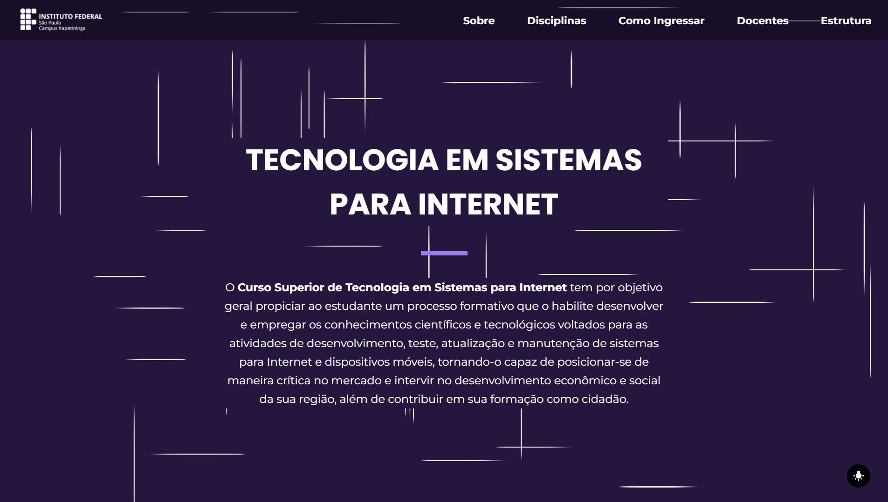

# Tecnologia em Sistemas para Internet (TecWeb)

# Descrição do Projeto

O Curso Superior de Tecnologia em Sistemas para Internet tem por objetivo geral propiciar ao estudante um processo formativo que o habilite desenvolver e empregar os conhecimentos científicos e tecnológicos voltados para as atividades de desenvolvimento, teste, atualização e manutenção de sistemas para Internet e dispositivos móveis, tornando-o capaz de posicionar-se de maneira crítica no mercado e intervir no desenvolvimento econômico e social da sua região, além de contribuir em sua formação como cidadão.

# Status do Projeto
Status: Finalizado.

# Funcionalidades e Demonstração
O projeto exibe diversas informações sobre o curso superior de Tecnologia em Sistemas para Internet, principais áreas e disciplinas do curso, como ingressar no curso, informações sobre os docentes, localização e estrutura do Câmpus, dentre outras informações.

# Instruções de Uso
Iniciando o repositório para teste ou manutenção, é necessário primeiro abrí-lo; se necessário, primeiro é necessário clona-lo na sua máquina usando no Terminal o comando:
`git clone (link)`
Após isso, abra a pasta clonada do TecWeb no VSCode, clique no botão "Go live" que estará localizado no canto inferior esquerdo (é necessario baixar a extensão "Live Server" no VSCode), e então o projeto será iniciado localmente e estará pronto para ser utilizado.

# Acesso ao Projeto (Link do Projeto)
[TecWeb](https://tecweb.fabsoftware.itp.ifsp.edu.br/)

# Contribuição/Autores
| [ Luma Karoline de Siqueira](https://github.com/maLu70)